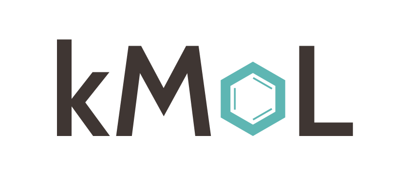

--------------------------------------------------------------------------------

# kMoL

kMoL is a machine learning library for drug discovery and life sciences, with federated learning capabilities.
It includes state-of-the-art graph-based predictive models that can treat molecular structures as graphs, and can predict ADME properties (Absorption, Distribution, Metabolism, Excretion), toxicity, and binding affinities.
We also provide explainable AI components, and differential privacy for data protection.
 
Models are built using PyTorch and PyTorch Geometric.

## Installation

Dependencies can be installed with conda:
```bash
conda env create -f environment.yml
conda activate kmol
bash install.sh
```

## Local Examples

All experiments are performed using configuration files (JSON).

A detailed documentation on how to write configuration files can be found under section 3.4 of `docs/documentation.pdf`.
Sample configurations can be found under `data/configs/model/`.

Each experiment starts with a dataset.
In these examples we focus on the [Tox21 Dataset](https://tripod.nih.gov/tox21/challenge/data.jsp) for which we define the experimental settings in `data/configs/model/tox21.json`.
After downloading the dataset to a suitable location, point to dataset with the "input_path" option in this JSON file.

### Training
The `train` command can be used to train a model. 
 
```bash
kmol train data/configs/model/tox21.json
```

### Finding the best checkpoint
Training will save a checkpoint for each individual epoch. 
These can be evaluated on a test split to find the best performing one with the `find_best_checkpoint` command.

```bash
kmol find_best_checkpoint data/configs/model/tox21.json
```

### Validate (a single checkpoint):
If a `checkpoint_path` is set in the JSON file for a specific checkpoint, it can be evaluated with the `eval` command. 

```bash
kmol eval data/configs/model/tox21.json
```

### Predict
Running inference is possible with the `predict` command.
This is performed on the test split by default.

```bash
kmol predict data/configs/model/tox21.json
```

A list of all available commands is available in the documentation.

## Federated Learning Examples

Similar to local training, a JSON configuration is needed to specify the training options.

In addition, a configuration file is needed for the server and each individual client to establish proper communication.
A detailed documentation on how to configure the server and clients can be found under section 3.5.1 and 3.5.2 of `docs/documentation.pdf` respectively.
Sample configurations can be found under `data/configs/mila/`.  

### Starting the server
The server should start before clients start connecting.

```bash
mila server data/configs/mila/naive_aggregator/tox21/clients/2/server.json
```

### Starting a client
Once the server is up, clients can join the federated learning process.
```bash
mila client data/configs/mila/naive_aggregator/tox21/clients/2/client1.json
```

Servers can be configured to wait for a specific number of clients.
Another client can be simulated from a new terminal:
```bash
mila client data/configs/mila/naive_aggregator/tox21/clients/2/client2.json
```
